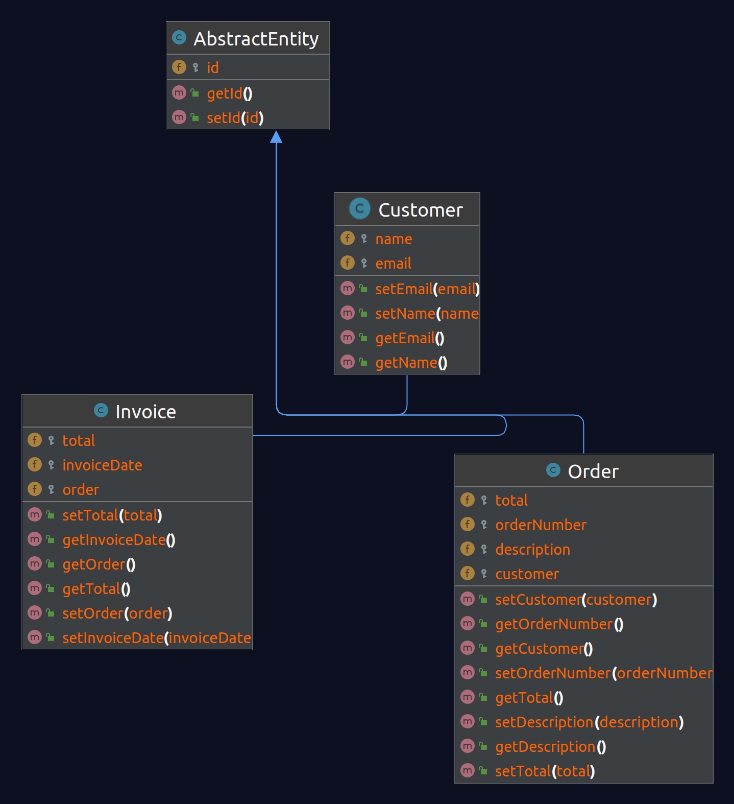
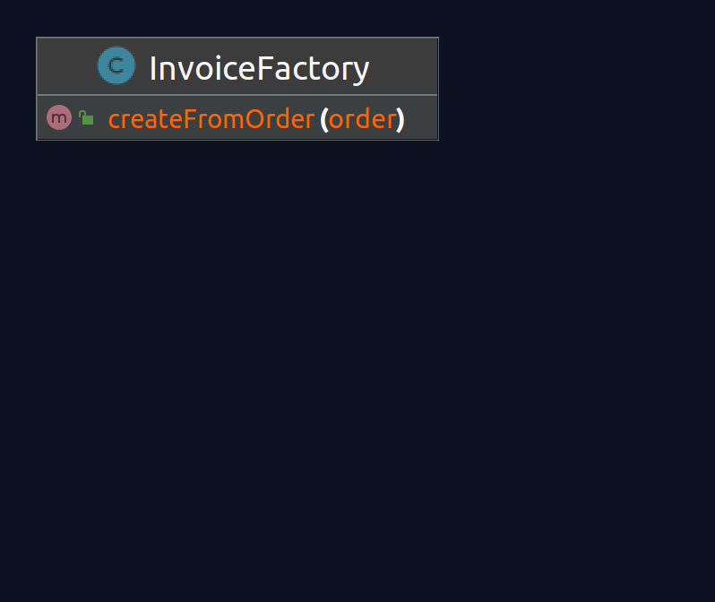
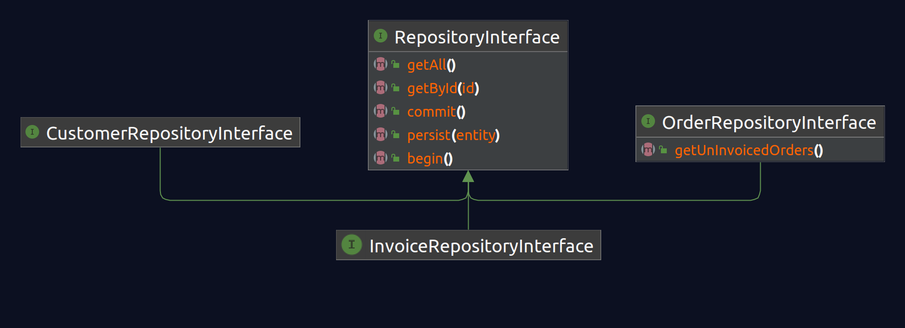
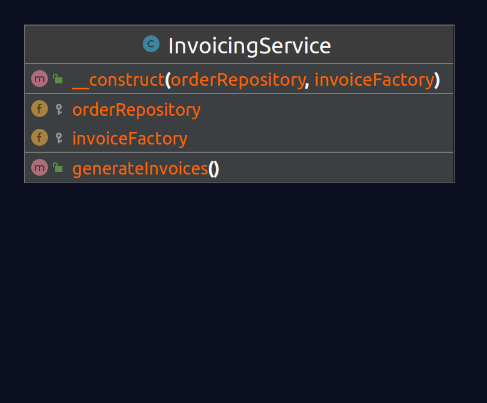

# cleanArchitectureInPhp

## Description:

- A study case on ["The Clean Architecture in PHP by Kristopher Wilson"](https://www.google.com/search?channel=fs&client=ubuntu&q=The+Clean+Architecture+in+PHP+by+Kristopher+Wilson)
- writen in PHP 7

## Implementations:

- [zendframework3](https://github.com/L37sg0/cleanArchitectureInPhp/tree/zf3-setup)

## UML Diagrams:

### Entity

### Factory

### Repository

### Service
